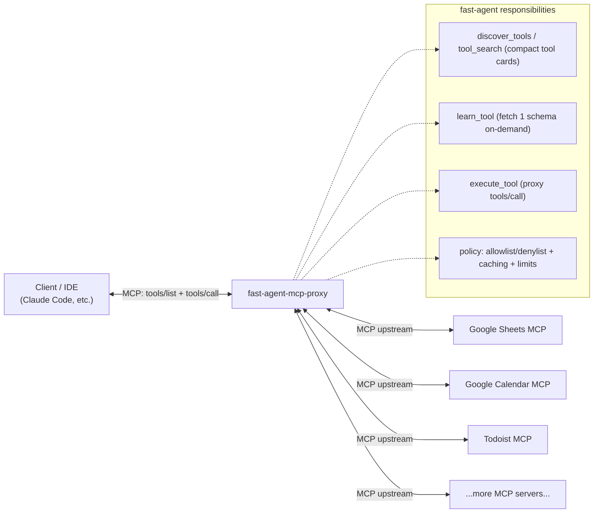

# Fast-agent as an “Advanced Tool Use” runtime for MCP: static config-based filtration + dynamic discover/learn/execute + MCP-proxy mode to reduce tool context bloat (#589)

- **Tracking issue (fast-agent):** https://github.com/evalstate/fast-agent/issues/589  
- **Motivating example (mcp-google-sheets):** https://github.com/xing5/mcp-google-sheets/issues/58  
- **Reference (Anthropic):** https://www.anthropic.com/engineering/advanced-tool-use  
- **Related concept source (mcp-agent):** https://github.com/lastmile-ai/mcp-agent
- **Scope (fast-agent #589):** Fast-agent as an “Advanced Tool Use” runtime for MCP: static config-based filtration + dynamic discover/learn/execute + MCP-proxy mode to reduce tool context bloat

---

## The problem: MCP tool schemas eat your context before you do any work

The MCP ecosystem made “plug in any tool server” pleasantly easy… and accidentally made “blow 30–100k tokens on tool definitions” easy too.

A concrete report from the field: **mcp-google-sheets** exposes 17 tools and burns **~13,000 tokens** on schemas at connect time; add a couple more MCP servers and you’re at **~32k tokens** before the user types anything. That means more `/clear`, less continuity, and worse “agent feel.”  
See: https://github.com/xing5/mcp-google-sheets/issues/58

Anthropic describes the same systemic pattern and frames it as **tool definition bloat**. Their examples show multi-server setups costing **~55k tokens** upfront (and even **134k** in internal cases) — before conversation starts. Their core recommendation: **stop loading all tool definitions upfront; move to on-demand discovery and selective loading.**  
See: https://www.anthropic.com/engineering/advanced-tool-use


*Source: https://www.anthropic.com/engineering/advanced-tool-use (figure: Context Usage: Traditional vs. Tool Search Tool).*

---

## Two solution families (and why we want both)

Phase 1 is static config-based filtration (see section below); the long-term path is Advanced Tool Use (on-demand discovery + selective schema loading).

### “Systemic architecture”: Advanced Tool Use (on-demand discovery + selective schema loading)
Anthropic’s “Advanced Tool Use” pattern is essentially:
- Provide a **search tool** over tools
- **Defer loading** detailed schemas until the model actually needs them
- (Optionally) move multi-step orchestration into **code execution** so intermediate outputs don’t pollute the model context
- Provide **tool use examples** to teach correct usage beyond what JSON Schema can express

This maps very naturally onto MCP, but MCP clients don’t universally support deferred loading semantics today. So the most practical place to implement this is a **proxy layer**.

---

## Proposal: fast-agent as an “Advanced Tool Use” MCP proxy

fast-agent already appears to have the right building blocks:
- MCP client/session/connection management
- a server registry layer
- existing examples/tests around **MCP tool filtering**

Evidence in repo structure (examples / modules):
- `src/fast_agent/mcp_server_registry.py`  
- `src/fast_agent/mcp/mcp_connection_manager.py`  
- `src/fast_agent/mcp/mcp_agent_client_session.py`  
- filtering examples/tests: `tests/integration/mcp_filtering/...`, `examples/mcp/mcp-filtering/...`  
(See repo: https://github.com/evalstate/fast-agent)

This makes fast-agent an excellent candidate to become a **single MCP endpoint** for IDEs/clients, while it privately manages N upstream MCP servers.

### The core idea
Instead of connecting Claude/IDE directly to many MCP servers (and inheriting all their schema bloat), connect the client to **one** MCP server: **fast-agent-proxy**.

fast-agent-proxy then:
- Connects upstream to your tool-heavy MCP servers (Sheets, Calendar, Slack, etc.)
- Exposes only a **tiny meta-tool surface** to the model/client
- Pulls full tool schemas **only when needed**

---

# static config-based filtration

Phase 1 (policy controls in #589): add static `tools` filtering in `fastagent.config.yaml` with the same semantics as AgentCard (per-server allowlist, names or glob patterns; omitted means “allow all”).

### 1) “Local scalpel”: allowlist / include-tools (per server)
This is what issue #58 asks for: add `--include-tools` or `ENABLED_TOOLS` so the server filters its own `tools/list` response.

Examples (fastagent.config.yaml):

```yaml
mcp:
  servers:
    github:
      command: "npx"
      args: ["-y", "@modelcontextprotocol/server-github"]
      tools: ["search_repositories", "list_issues", "get_file"]
```

```yaml
mcp:
  servers:
    slack:
      url: "https://slack-mcp.example.com/mcp"
      tools: ["conversations_*", "chat_postMessage"]
    filesystem:
      command: "npx"
      args: ["-y", "@modelcontextprotocol/server-filesystem", "."]
      tools: ["read_file", "list_*"]
```

**Pros**
- Simple
- Works with any client
- Good security posture (least privilege)

**Cons**
- Requires changes in every MCP server
- Still upfront-loads schemas for allowed tools (which can still be heavy)
- Doesn’t scale well when you have *many* servers and want dynamic selection

### Issue strategy (phased)

- Phase 1: static `tools` filtering in `fastagent.config.yaml` (AgentCard semantics) to reduce initial schema load without protocol changes
- Phase 2: `discover/learn/execute` meta-tools + on-demand schema hydration + caching in proxy mode
- Phase 3: Tool Use Examples + Programmatic Tool Calling to improve correctness and reduce context churn

## The “discover → learn → execute” interface

At minimum, fast-agent-proxy can expose these tools (names illustrative):

### 1) `discover_tools(query?, server?)`
Returns compact “tool cards”:
- tool name
- short description
- server/source
- tags / capabilities
- (optional) 1–2 key parameters

This keeps discovery cheap and searchable.

### 2) `learn_tool(server, tool)`
Returns the **full JSON schema** (and optionally examples) for *one* tool on demand.

### 3) `execute_tool(server, tool, args)`
Proxies `tools/call` upstream and returns results.

Optional but useful:
- `list_servers()` (enumerate configured upstream servers)
- `pin_tools([...])` (keep a few always-loaded)
- `tool_docs(tool)` or MCP Resources-based docs for richer guidance without bloating tool schemas

---

## Why this solves context bloat (even if upstream servers don’t)

Because the client (Claude/IDE) only sees:
- the 3–5 meta-tools above
- plus any “pinned” frequently-used tools

Everything else remains “dark matter” until it’s actually needed.

This directly addresses the #58 pain: even if an upstream MCP server insists on exposing 17 tools, the proxy can:
- either never surface them unless searched
- or surface only an allowlisted subset
- or surface compact cards first, schema later

So: **no forks required**, and you still get least-privilege controls.

---

## Bonus: Tool Use Examples (the missing ingredient in most MCP setups)

JSON Schema answers “what is valid,” not “what is correct.”

Anthropic’s recommendation of **Tool Use Examples** is especially relevant to MCP servers whose schemas are large and nuanced. Examples teach:
- formatting conventions (dates, IDs)
- correlations between fields
- minimal vs fully-specified calls
- safe defaults

In a proxy world, examples can live in:
- proxy-side “registry metadata” (YAML/JSON alongside config)
- upstream server annotations (if available)
- a curated knowledge layer (docs/resources)

A proxy can attach these examples when returning `learn_tool(...)` so the model learns correct usage without seeing 17 giant schemas upfront.

---

## Bonus: Programmatic tool calling (when it matters)

Some tasks are inherently multi-step:
- iterate over many entities
- merge and filter lots of records
- handle pagination/retries
- run parallel calls safely

Anthropic’s “Programmatic Tool Calling” pattern pushes orchestration into code execution so that intermediate results never inflate the model’s context. In an MCP proxy architecture, fast-agent could optionally:
- execute orchestration code locally
- call upstream tools repeatedly
- return only the final distilled result to the model

This is not required for the MVP, but it’s a powerful second step once discovery/learn/execute is in place.

---

## Where lastmile-ai/mcp-agent fits (concept lineage)

The “hub that connects to multiple MCP servers and aggregates them” concept is something many people first see in **lastmile-ai/mcp-agent**:
- repo: https://github.com/lastmile-ai/mcp-agent
- it includes MCP-focused primitives and an **aggregator**-style module (e.g. `src/mcp_agent/mcp/mcp_aggregator.py`) and multiple MCP examples.

In other words:
- **mcp-agent** helped popularize “MCP aggregation/orchestration”
- **fast-agent** can take the next step: “aggregation + advanced tool-use ergonomics (on-demand discovery + schema deferral)”

These are complementary approaches; fast-agent can borrow the best ideas while focusing on being the “advanced tool use runtime” layer.

---

## Minimal implementation sketch (proxy MVP)

### Config
- fast-agent reads a config describing upstream MCP servers (commands, args, env)
- Phase 1: add static `tools` filtering in `fastagent.config.yaml` with the same semantics as AgentCard
- add optional allowlist/denylist per server
- add optional tool metadata/examples per tool

### Runtime
1. fast-agent starts an MCP server (for the IDE/client)
2. fast-agent connects to upstream MCP servers in the background
3. On `tools/list`, fast-agent returns only meta-tools (+ pinned)
4. On `discover_tools`, fast-agent queries upstream `tools/list` internally, caches compact tool cards
5. On `learn_tool`, fast-agent fetches schema for a single tool (cache with TTL/LRU)
6. On `execute_tool`, fast-agent proxies the call and returns results

### Practical considerations
- **Namespacing:** `server.tool` or separate `server` field
- **Caching:** schema TTL + LRU to avoid memory spikes
- **Safety:** allowlist/denylist + “high-risk tool” confirmation gates
- **Stability:** handle upstream schema changes gracefully

---

## Ecosystem overview: who else is trying to solve parts of this problem?

### Registries / directories (discoverability and standardization)
- modelcontextprotocol/registry — https://github.com/modelcontextprotocol/registry
- agentic-community/mcp-gateway-registry — https://github.com/agentic-community/mcp-gateway-registry
- toolsdk-ai/toolsdk-mcp-registry — https://github.com/toolsdk-ai/toolsdk-mcp-registry
- mcp-get/community-servers — https://github.com/mcp-get/community-servers
- acuvity/mcp-servers-registry — https://github.com/acuvity/mcp-servers-registry

**Typical focus:** finding servers/tools, sharing metadata  
**Gap:** often not focused on context bloat mitigation at runtime

### Proxies / gateways (central control point: filtering, caching, policy)
- open-webui/mcpo — https://github.com/open-webui/mcpo
- microsoft/mcp-gateway — https://github.com/microsoft/mcp-gateway
- TBXark/mcp-proxy — https://github.com/TBXark/mcp-proxy
- punkpeye/mcp-proxy — https://github.com/punkpeye/mcp-proxy
- aws/mcp-proxy-for-aws — https://github.com/aws/mcp-proxy-for-aws

**Typical focus:** routing, auth, consolidation  
**Opportunity:** add “advanced tool use” semantics (search + deferral + learn) explicitly

### Agent runtimes / orchestration (where advanced tool-use patterns fit naturally)
- evalstate/fast-agent — https://github.com/evalstate/fast-agent
- lastmile-ai/mcp-agent — https://github.com/lastmile-ai/mcp-agent

**Typical focus:** building agents that use tools  
**Opportunity:** implement on-demand discovery and schema deferral as first-class runtime features

---

## Closing: why this matters

MCP made tools composable. Advanced tool use makes tools *usable at scale*.

Per-server allowlists (like #58) are a good tactical fix.  
A proxy/runtime approach (like fast-agent issue #589) is the strategic fix:
- keeps initial context small
- scales to dozens of MCP servers
- preserves flexibility and security controls
- makes tool choice more accurate via search + examples
- enables programmatic orchestration when needed

If the MCP world is a bazaar, this is the part where we stop carrying the entire bazaar in our pockets.

## Tiny diagram: client ↔ fast-agent ↔ upstream MCP servers



## Token savings estimate (rule-of-thumb)

### Baseline (direct MCP servers)
Using real-world numbers reported in the MCP ecosystem:
- Google Sheets MCP: ~13k tokens upfront (17 tools)
- Google Calendar MCP: ~15k tokens upfront
- Todoist MCP: ~3k tokens upfront
**Total upfront:** ~31k tokens (≈ “30k upfront”)

### With fast-agent as an Advanced Tool Use proxy
Assumptions:
- fast-agent exposes only 3–5 small meta-tools (tool_search / learn_tool / execute_tool / list_servers)
  → ~1–2k tokens upfront
- during a typical task, only a few tool schemas are “hydrated” on demand (2–4 tools)
  → ~2–5k tokens on-demand (depends on schema verbosity)
Exact numbers vary by schema verbosity, but the structural win is eliminating unused tool schemas from the initial context.

**Typical session cost:** ~3–7k tokens (vs ~30–32k upfront)

### Savings summary
- Upfront reduction: ~30k → ~1–2k (≈ 93–97% less upfront)
- Typical session reduction: ~30–32k → ~3–7k (≈ 75–90% less overall)
